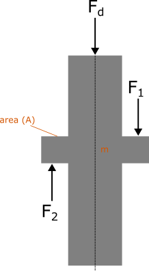
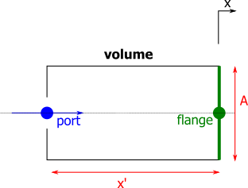
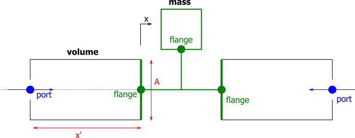
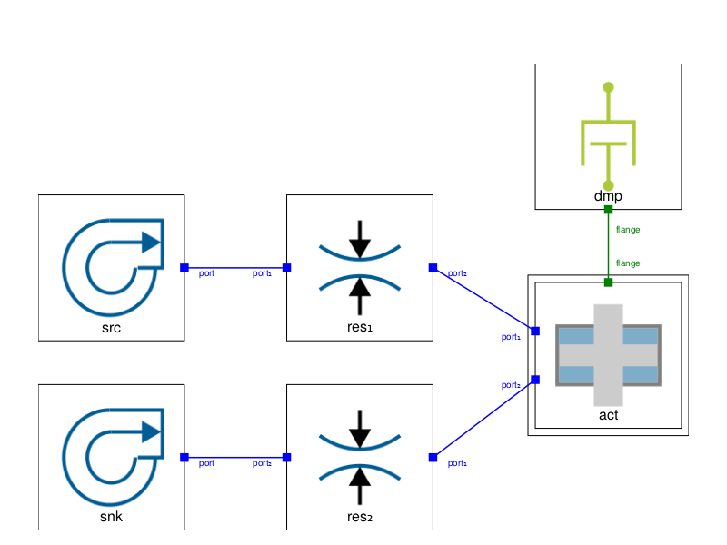

# Introduction
This repo contains the code presented in the JuliaHub workshop "Introduction to ModelingToolkit.jl for Industrial Modelers" given on December 7th, 2023.  The code solves the Actuator Safety Design problem.  The diagram below represents the problem to be solved, which is to solve for an appropriate orifice area ($A_o$) such that the actuator velocity ($\dot{x}$) is limited.

# Derivations
## Orifice
The orifice pressure drop is defined by the manufacturer as 

$$\Delta p = \frac{1}{2} \rho u^2 C_d$$

Where
- $\Delta p$  is the pressure drop [$Pa$]
- $\rho$  is the fluid density [$kg/m^3$]
- $u$ is the nominal fluid velocity thru the orifice [$m/s$]
- $C_d$ is the resistance coefficient = 2.7

The fluid velocity thru the orifice is found from

$$u = Q/A_o$$

Where
- $Q$ is the flow rate [$m^3/s$] 
- $A_o$ is the orifice area [$m^2$] 

The flow rate is known from the actuator

$$Q = A \dot{x}$$

Where
- $A$ is the area of the actuator face [$m^2$] 
- $\dot{x}$ is the velocity of the actuator [$m/s$]

## Actuator
The actuator can be derived from Newton's 2nd law 

$$m \ddot{x} = F_2 - F_1 - F_d$$

Where
- $m$ is the mass of the actuator [$kg$] 
- $x$ is the actuator position [$m$]
- $\dot{x}$ is the actuator velocity [$m/s$]
- $\ddot{x}$ is the actuator acceleration [$m/s^2$] 
- $F_1$ is the pressure pushing down on the actuator ($p_1 A$) [$N$]
- $F_2$ is the pressure pushing up on the actuator ($p_2 A$) [$N$]
- $F_d$ is the damping resistance ($c \dot{x}$) [$N$]
- $p$ is pressure [$Pa$] 
- $A$ is the area of the actuator face [$A$]
- $c$ is the damping coefficient [$N/(m/s)$] 

## Incompressible Flow System
The system of equaitons for the incompressible system then is 

$$u = \dot{x} \frac{A}{A_o}$$

$$p_s - p_1 = \frac{1}{2} \rho u^2 C_d$$

$$p_2 - p_r = \frac{1}{2} \rho u^2 C_d$$

$$m \ddot{x} = (p_2 - p_1) A - c \dot{x}$$

# Steady State Solution
Given the actuator max velocity should be $\dot{x} = 1m/s$, solve for the orifice area and resulting pressures

$${\color{red}u} = \dot{x} \frac{A}{\color{red}A_o}$$

$$p_s - {\color{red}p_1} = \frac{1}{2} \rho {\color{red}u}^2 C_d$$

$${\color{red}p_2} - p_r = \frac{1}{2} \rho {\color{red}u}^2 C_d$$

$$0 = ({\color{red}p_2} - {\color{red}p_1}) A - c \dot{x}$$

Note: for steady state $\ddot{x} = 0$

# Transient Solution
Given the orifice area $A_o$, solve for the transient response

$${\color{red}u} = {\color{red}\dot{x}} \frac{A}{A_o}$$

$$p_s - {\color{red}p_1} = \frac{1}{2} \rho {\color{red}u}^2 C_d$$

$${\color{red}p_2} - p_r = \frac{1}{2} \rho {\color{red}u}^2 C_d$$

$$m {\color{red}\ddot{x}} = ({\color{red}p_2} - {\color{red}p_1}) A - c {\color{red}\dot{x}}$$

# Compressible Flow System - Using Component Based Modeling
## Volume Component

### Mass Flow (port)
The volume component will be defined as a cylinder with a moving wall.  Starting with the conservation of mass in and out of the cylinder

$$\dot{m} = \frac{\partial}{\partial t} \left( \rho V \right)$$

Where
- $\dot{m}$ is mass flow [$kg/s$]
- $\rho$ is density [$kg/m^3$]
- $V$ is volume $=x A$ [$m^2$] 

In other words, the mass flow in and out of the cylinder is a function of the change in time of density and volume.  Expanding the derivative gives

$$\dot{m} = \dot{\rho} V + \rho \dot{V}$$

### Forces (flange)
The force output is simply pressure applied on the moving area

$$F = p A$$

## Actuator Component

## Complete System

